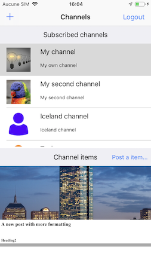

## Rainbow SDK Sample

### Setting the development environnement 
---
For informations about development environnement you should look for [SDK for iOS: Getting Started](https://hub.openrainbow.com/#/documentation/doc/sdk/ios/guides/Getting_Started)

### Login to Rainbow server
---
For informations about the login process you should look for [SDK for iOS: Getting Started](https://hub.openrainbow.com/#/documentation/doc/sdk/ios/guides/Getting_Started)

### Channels
---
The aim of this sample project is to demonstrate the Channels API. After the login screen the channels you have subscribed will be listed and you'll be able to display the items posted in each of them. You might then post new items in the channels where you are allowed to do it and also create new channels.

A sample screenshot :

For more information about the channel API you may look at the [iOS channel API guide](https://hub.openrainbow.com/#/documentation/doc/sdk/ios/api/Managing_Channels) on the [Rainbow API Hub](https://hub.openrainbow.com/).

