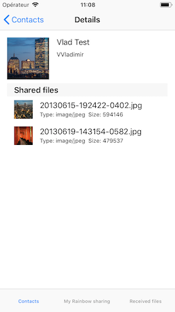
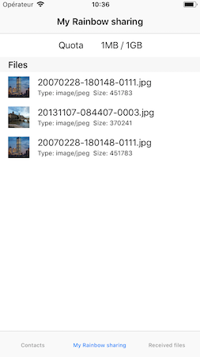
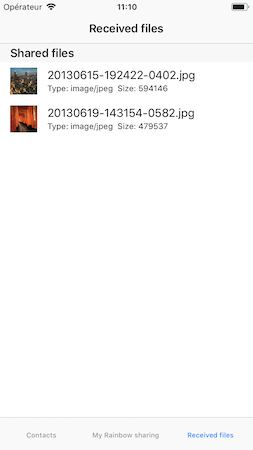

## Rainbow SDK Sample

### Setting the development environnement 
---
For informations about development environnement you should look for [SDK for iOS: Getting Started](https://hub.openrainbow.com/#/documentation/doc/sdk/ios/guides/Getting_Started)

### Login to Rainbow server
---
For informations about the login process you should look for [SDK for iOS: Getting Started](https://hub.openrainbow.com/#/documentation/doc/sdk/ios/guides/Getting_Started)

### File sharing
---
The aim of this sample project is to demonstrate Rainbow file sharing on the cloud. After the login screen your actual contacts are listed.

- In the first tab you can select a contact to display more information about him and the files he shares with you. 
- In the second tab all the files of "My Rainbow sharing" are listed.
- In the third tab all received files are listed

A sample screenshot:

  

For more information about the file sharing API you may look at the [iOS file sharing API guide](https://hub.openrainbow.com/#/documentation/doc/sdk/ios/api/File_Sharing) on the [Rainbow API Hub](https://hub.openrainbow.com/).

