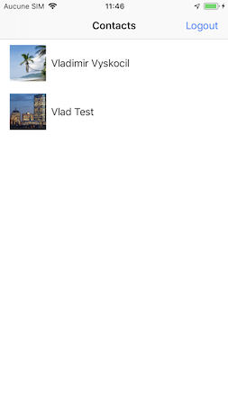
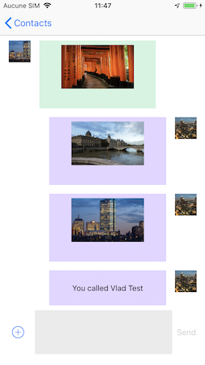

## Rainbow SDK Sample

### Setting the development environnement 
---
For informations about development environnement you should look for [SDK for iOS: Getting Started](https://hub.openrainbow.com/#/documentation/doc/sdk/ios/guides/Getting_Started)

### Login to Rainbow server
---
For informations about the login process you should look for [SDK for iOS: Getting Started](https://hub.openrainbow.com/#/documentation/doc/sdk/ios/guides/Getting_Started)

### Instant Messaging
---
The aim of this sample project is to demonstrate the Instant Messaging API. After the login screen your actual contacts are listed and you could start IM messaging with them.

Sample screenshots:

 

For more information about the file sharing API you may look at the [iOS instant messaging API guide](https://hub.openrainbow.com/#/documentation/doc/sdk/ios/api/Instant_Messaging) on the [Rainbow API Hub](https://hub.openrainbow.com/).

