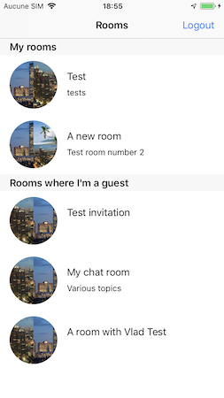
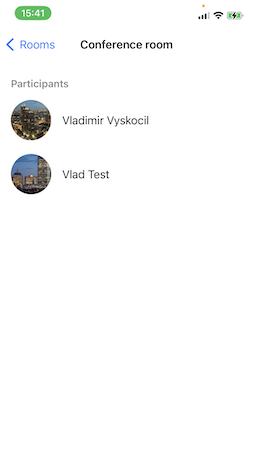

## Rainbow SDK Sample

### Setting the development environnement 
---
For informations about development environnement you should look for [SDK for iOS: Getting Started](https://hub.openrainbow.com/#/documentation/doc/sdk/ios/guides/Getting_Started)

### Login to Rainbow server
---
For informations about the login process you should look for [SDK for iOS: Getting Started](https://hub.openrainbow.com/#/documentation/doc/sdk/ios/guides/Getting_Started)

### WebRTC conferences
---
The aim of this sample project is to demonstrate WebRTC audio conferences. After the login screen, the rooms you are the owner and the ones you have accepted the invitation and where a conference is started by the organizer, are listed. You could select one of theses rooms and you should be connected to the conference, if you are the owner of the room the conference will be started.

Here are sample screenshots:

 &nbsp;&nbsp;&nbsp;&nbsp;

